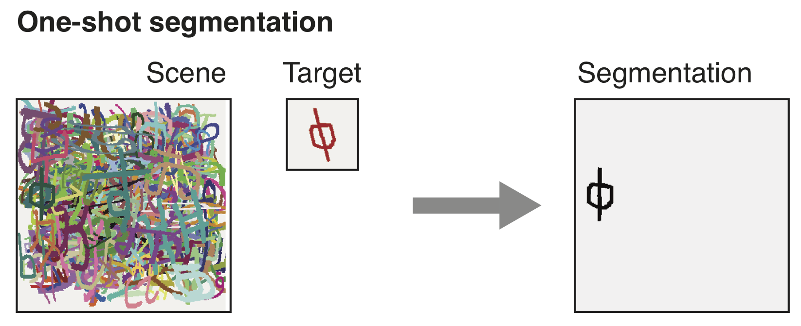
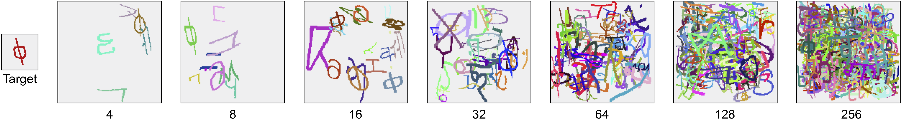
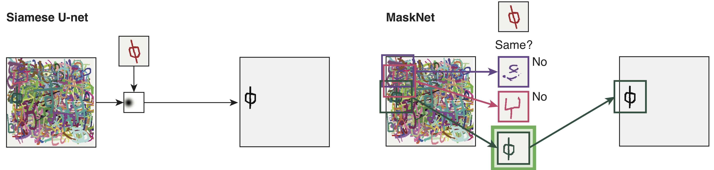

# Cluttered Omniglot data set

 

This repository contains code to generate the Cluttered Omniglot data set and reproduce the results from our corresponding paper [One-Shot Segmentation in Clutter](https://arxiv.org/abs/1803.09597).

### CONTENTS

#### Cluttered Omniglot

The Cluttered Omniglot data set contains training, evaluation and test sets for different clutter levels. The training set is generated using the 30 alphabets from the background set of the original [Omniglot dataset](https://github.com/brendenlake/omniglot)[1]. For evaluation and test there exist two sets each, one created with the 30 alphabets from the training set and one created with the 20 alphabets from the evaluation set of the original Omniglot dataset. 

To compare with the results in our paper, clutter levels of 4, 8, 16, 32, 64, 128 and 256 should be used. For evaluation only the validation set with training characters should be used during model optimization and training (including hyperparameter search).

__Important Update 5. Sept. 2018:__ 
Due to a bug in the dataset generation the number of distractors per image was randomly sampled instead of fixed and thus on average too low. The valid benchmark using the same data generation as in the paper is the one which can be created with the code and checksums updated on the 5th of September 2018. If you use an older version of the dataset please update the test splits accordingly.

#### Experiments

The Siamese-U-Net baseline consists of two identical encoders for the target and the scene and a mirrored decoder with skip connections. Currently one model is trained per clutter level but we will try to train one model jointly on all clutter levels. 

MaskNet uses a two-stage approach generating segmentation proposals in the first stage to generate candidate segmentations and subsequently a second encoding stage to compare each of these segmentations to the target. 

The code for Siamese-U-Net and MaskNet are online now. Checkpoints can be automatically downloaded and extracted to reproduce the results from the paper using the reproduce_results.ipynb notebook or downloaded separately for [Siamese-U-Net](https://dl.dropbox.com/s/bm625f6ns04g4ea/siamese_u_net_checkpoints.zip) and [MaskNet](https://dl.dropbox.com/s/sc8pevf2h6152i0/mask_net_checkpoints.zip). 

#### Posters
Our ICML 2018 poster, where our [paper was published](http://proceedings.mlr.press/v80/michaelis18a.html):

Our VSS 2019 poster including human performance on cluttered omniglot and an overview of our follow up paper [One-Shot Instance Segmentation](https://arxiv.org/abs/1811.11507) ([code](https://github.com/bethgelab/siamese-mask-rcnn)) in which we generalized the one-shot segmentation task to instance segmentation on MS Coco. 

### Instructions

Python 3.4.*   
Requires scipy, numpy, pillow, urllib, zipfile, matplotlib and joblib    

To generate the data first run the get_omniglot.ipynb notebook, to download, extract and convert the original Omniglot dataset. Then run the generate_dataset.ipynb notebook to generate training, validation and test splits for all clutter levels used in the paper (4, 8, 16, 32, 64, 128, 256 characters). Fixed seeds and checksums are included to verify the final outputs for the validation and test sets.
WARNING: The dataset is quite large (>500GB) and requires large amounts of RAM to generate. The generation of the training set might therefore be split into multiple parts.

Code to train and evaluate the Siamese-U-Net baseline as used in the paper can be found in the corresponding siamese_u_net.ipynb notebook. To reproduce the results form the paper the model should be trained for 20 epochs with a batch size of 250, a leraning rate of 0.0005 and feature_maps = 24. For GPU training a GPU with >12GB of memory is needed.

Code to train and evaluate MaskNet as used in the paper can be found in the corresponding mask_net.ipynb notebook. The training is performed in two steps, first finetuning the encoder and decoder and subsequently training the discriminator. To reproduce the results form the paper both steps should be trained for 5 epochs with feature_maps = 24. For the first step a batch size of 50 and a leraning rate of 0.00005 and for the second step a batch size of 250 and a learning rate of 0.00025 should be selected. For GPU training a GPU with >12GB of memory is needed.

Code to reproduce the results from the paper can be found in the reproduce_results.ipynb notebook. Results might differ slightly from the numbers reported in the paper because we re-generated the test data set.

### Citing this data set
Please cite the following paper:

[C. Michaelis, M. Bethge, and A. S. Ecker (2018) One-Shot Segmentation in Clutter](https://arxiv.org/abs/1803.09597)
_ICML 2018_

### Citations
[1][Lake, B. M., Salakhutdinov, R., and Tenenbaum, J. B. (2015). Human-level concept learning through probabilistic program induction.](http://www.sciencemag.org/content/350/6266/1332.short) _Science_, 350(6266), 1332-1338.
